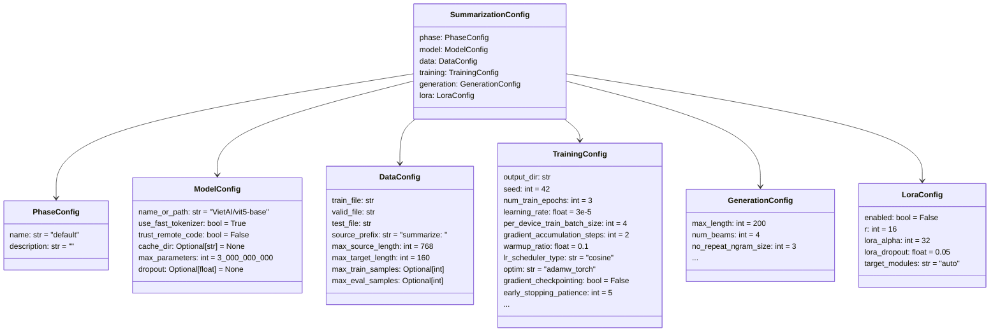

# Tài Liệu Chi Tiết: Quy Trình Huấn Luyện Mô Hình ViT5

> [!NOTE]
> Tài liệu này mô tả **toàn bộ quy trình huấn luyện** (training pipeline) của dự án tóm tắt văn bản tiếng Việt, bao gồm từng bước, từng hàm được gọi, đầu vào, đầu ra, và cách thức hoạt động khi chạy trên **Kaggle Notebook**.

---

## Mục Lục

1. [Tổng Quan Kiến Trúc](#1-tổng-quan-kiến-trúc)
2. [Cách Chạy Trên Kaggle](#2-cách-chạy-trên-kaggle)
3. [Bước 1: Entry Point — scripts/train.py](#3-bước-1-entry-point--scriptstrainpy)
4. [Bước 2: Tải Cấu Hình — src/config.py](#4-bước-2-tải-cấu-hình--srcconfigpy)
5. [Bước 3: Hàm train() Điều Phối — src/trainer.py](#5-bước-3-hàm-train-điều-phối--srctrainerpy)
6. [Bước 4: Chuẩn Bị Môi Trường — _prepare_run()](#6-bước-4-chuẩn-bị-môi-trường--_prepare_run)
7. [Bước 5: Chuẩn Bị Mô Hình — _prepare_model()](#7-bước-5-chuẩn-bị-mô-hình--_prepare_model)
8. [Bước 6: Nạp & Xử Lý Dữ Liệu — _load_training_datasets()](#8-bước-6-nạp--xử-lý-dữ-liệu--_load_training_datasets)
9. [Bước 7: Xây Dựng Trainer — _build_trainer()](#9-bước-7-xây-dựng-trainer--_build_trainer)
10. [Bước 8: Vòng Lặp Huấn Luyện — trainer.train()](#10-bước-8-vòng-lặp-huấn-luyện--trainertrain)
11. [Bước 9: Lưu & Đánh Giá Kết Quả](#11-bước-9-lưu--đánh-giá-kết-quả)
12. [Sơ Đồ Luồng Tổng Thể](#12-sơ-đồ-luồng-tổng-thể)
13. [Chi Tiết Cấu Hình YAML](#13-chi-tiết-cấu-hình-yaml)
14. [Bảng Tổng Hợp Tất Cả Các Hàm](#14-bảng-tổng-hợp-tất-cả-các-hàm)

---

## 1. Tổng Quan Kiến Trúc

Dự án được tổ chức theo mô hình **2 tầng**:

| Tầng | Thư mục | Vai trò |
|------|---------|---------|
| **Entry Point** (Kịch bản chạy) | `scripts/` | Các file chạy trực tiếp từ Terminal. Đọc tham số dòng lệnh, gọi vào `src/`. |
| **Core Library** (Thư viện lõi) | `src/` | Chứa toàn bộ logic: config, model, data, trainer, metrics, utils. Được `import` bởi `scripts/`. |

Quy trình train sử dụng **2 giai đoạn (phases)**:

| Giai đoạn | Config YAML | Mô tả |
|-----------|------------|-------|
| **Phase 1** | [vit5_base_phase_1.yaml](file:///home/dungcony/projects/python/thuc-tap/tuan%205-6/configs/vit5_base_phase_1.yaml) | Fine-tune **toàn bộ** mô hình `VietAI/vit5-base` trên dữ liệu tổng quát |
| **Phase 2** | [vit5_base_phase_2.yaml](file:///home/dungcony/projects/python/thuc-tap/tuan%205-6/configs/vit5_base_phase_2.yaml) | Fine-tune tiếp checkpoint tốt nhất của Phase 1 trên dữ liệu chuyên ngành (y khoa) |

---

## 2. Cách Chạy Trên Kaggle

Trên Kaggle Notebook, bạn gọi lệnh sau trong một cell:

```python
# Phase 1: Fine-tune toàn bộ trên dữ liệu tổng quát
!python scripts/train.py --config configs/vit5_base_phase_1.yaml

# Phase 2: Fine-tune tiếp trên dữ liệu chuyên ngành
!python scripts/train.py --config configs/vit5_base_phase_2.yaml
```

Có thể ghi đè tham số ngay trên dòng lệnh:
```python
!python scripts/train.py \
    --config configs/vit5_base_phase_1.yaml \
    --epochs 5 \
    --batch-size 2 \
    --learning-rate 3e-5 \
    --output-dir /kaggle/working/outputs_phase_1
```

---

## 3. Bước 1: Entry Point — scripts/train.py

📄 File: [scripts/train.py](file:///home/dungcony/projects/python/thuc-tap/tuan%205-6/scripts/train.py)

Đây là file bạn **chạy trực tiếp**. Nó thực hiện 3 việc:

### 3.1. Hàm `parse_arguments()`

| | Mô tả |
|---|---|
| **Vị trí** | [train.py dòng 36–90](file:///home/dungcony/projects/python/thuc-tap/tuan%205-6/scripts/train.py#L36-L90) |
| **Đầu vào** | Tham số dòng lệnh từ Terminal (`sys.argv`) |
| **Đầu ra** | `tuple[argparse.Namespace, dict]` — bộ (args, overrides) |
| **Tác dụng** | Phân tích dòng lệnh, tách các tham số ghi đè thành dict dạng `"section.field" → value` |

**Các tham số dòng lệnh hỗ trợ:**

| Tham số | Ánh xạ cấu hình | Ý nghĩa |
|---------|-----------------|---------|
| `--config` | *(bắt buộc)* | Đường dẫn tới file YAML |
| `--data-dir` | `data.train_file`, `data.valid_file` | Tự tìm file `.parquet` trong thư mục |
| `--train-file` | `data.train_file` | Đường dẫn file huấn luyện |
| `--valid-file` | `data.valid_file` | Đường dẫn file đánh giá |
| `--output-dir` | `training.output_dir` | Thư mục lưu kết quả |
| `--epochs` | `training.num_train_epochs` | Số vòng học |
| `--max-steps` | `training.max_steps` | Số bước tối đa (ghi đè epochs) |
| `--learning-rate` | `training.learning_rate` | Tốc độ học |
| `--batch-size` | `training.per_device_train_batch_size` | Kích thước batch |
| `--seed` | `training.seed` | Hạt giống ngẫu nhiên |
| `--resume` | `training.resume_from_checkpoint` | Đường dẫn checkpoint để chạy tiếp |
| `--set KEY=VALUE` | Bất kỳ `section.field` | Ghi đè nâng cao |

### 3.2. Hàm `main()` — Luồng Chính

| | Mô tả |
|---|---|
| **Vị trí** | [train.py dòng 15–33](file:///home/dungcony/projects/python/thuc-tap/tuan%205-6/scripts/train.py#L15-L33) |
| **Đầu vào** | Không (gọi `parse_arguments()` bên trong) |
| **Đầu ra** | In kết quả ra màn hình |

```
main()
  ├─ parse_arguments()          → (args, overrides)
  ├─ load_config(args.config)   → SummarizationConfig
  ├─ apply_overrides(config, overrides)  → SummarizationConfig (đã cập nhật)
  ├─ train(config)              → dict[str, float]  (eval metrics)
  └─ In "CÁC CHỈ SỐ CUỐI CÙNG" ra Terminal
```

---

## 4. Bước 2: Tải Cấu Hình — src/config.py

📄 File: [src/config.py](file:///home/dungcony/projects/python/thuc-tap/tuan%205-6/src/config.py)

### 4.1. Cấu Trúc Cấu Hình (Dataclasses)

Toàn bộ cấu hình được tổ chức thành **6 phần** (sections), mỗi phần là một Python `dataclass`:



### 4.2. Hàm `load_config()`

| | Mô tả |
|---|---|
| **Vị trí** | [config.py dòng 146–159](file:///home/dungcony/projects/python/thuc-tap/tuan%205-6/src/config.py#L146-L159) |
| **Đầu vào** | `config_path: str | Path` — đường dẫn tới file YAML |
| **Đầu ra** | `SummarizationConfig` — dataclass chứa toàn bộ cấu hình đã kiểm tra |
| **Tác dụng** | Đọc YAML → Xây dựng dataclass → Kiểm tra giá trị hợp lệ |

**Chuỗi gọi bên trong:**
```
load_config(path)
  ├─ yaml.safe_load(f)                  → raw dict
  └─ _build_config(raw)
       ├─ _build_section(PhaseConfig, ...)
       ├─ _build_section(ModelConfig, ...)
       ├─ _build_section(DataConfig, ...)
       ├─ _build_section(TrainingConfig, ...)
       ├─ _build_section(GenerationConfig, ...)
       ├─ _build_section(LoraConfig, ...)
       └─ validate_config(config)       → SummarizationConfig (hợp lệ)
```

### 4.3. Hàm `apply_overrides()`

| | Mô tả |
|---|---|
| **Vị trí** | [config.py dòng 162–202](file:///home/dungcony/projects/python/thuc-tap/tuan%205-6/src/config.py#L162-L202) |
| **Đầu vào** | `config: SummarizationConfig`, `overrides: dict[str, Any]` |
| **Đầu ra** | `SummarizationConfig` — bản sao đã ghi đè và kiểm tra lại |
| **Tác dụng** | Deep-copy config → Áp dụng từng override dạng `"training.learning_rate" → 5e-5` → Chuyển đổi kiểu dữ liệu → Kiểm tra lại toàn bộ |

### 4.4. Hàm `validate_config()`

| | Mô tả |
|---|---|
| **Vị trí** | [config.py dòng 211–346](file:///home/dungcony/projects/python/thuc-tap/tuan%205-6/src/config.py#L211-L346) |
| **Đầu vào** | `config: SummarizationConfig` |
| **Đầu ra** | `SummarizationConfig` (nếu hợp lệ) hoặc `raise ValueError` |
| **Tác dụng** | Gom tất cả lỗi cấu hình vào một thông báo duy nhất. Kiểm tra: giá trị rỗng, phạm vi hợp lệ, kết hợp không cho phép (VD: LoRA + freeze_encoder), tính nhất quán eval/save strategy. |

---

## 5. Bước 3: Hàm train() Điều Phối — src/trainer.py

📄 File: [src/trainer.py](file:///home/dungcony/projects/python/thuc-tap/tuan%205-6/src/trainer.py)

| | Mô tả |
|---|---|
| **Vị trí** | [trainer.py dòng 53–76](file:///home/dungcony/projects/python/thuc-tap/tuan%205-6/src/trainer.py#L53-L76) |
| **Đầu vào** | `config: SummarizationConfig` |
| **Đầu ra** | `dict[str, float]` — kết quả evaluation cuối cùng (VD: `{"eval_loss": 1.23, "eval_rouge1": 45.6, ...}`) |
| **Tác dụng** | Là hàm **điều phối chính**, gọi lần lượt tất cả các bước con |

**Luồng thực thi chi tiết của `train()`:**

```
train(config)
  │
  ├─ 1. _validate_training_setup(config)    ← Kiểm tra trước
  │
  ├─ 2. _prepare_run(config)                ← Tạo thư mục, set seed
  │      → output_dir: Path
  │
  ├─ 3. _prepare_model(config, output_dir)  ← Tải model + tokenizer + LoRA
  │      → _PreparedModel(tokenizer, model, base_fingerprint, adapter_manifest)
  │
  ├─ 4. _load_training_datasets(config, tokenizer)  ← Nạp & tokenize dữ liệu
  │      → DatasetDict {"train": ..., "validation": ...}
  │
  ├─ 5. _build_trainer(config, prepared_model, datasets)  ← Ghép thành Trainer
  │      → Seq2SeqTrainer
  │
  ├─ 6. trainer.train()                     ← VÒNG LẶP HUẤN LUYỆN CHÍNH
  │      → TrainOutput (chứa train_result.metrics)
  │
  ├─ 7. _save_best_checkpoint(...)          ← Lưu model tốt nhất
  │
  ├─ 8. trainer.evaluate()                  ← Đánh giá lần cuối
  │      → eval_results: dict[str, float]
  │
  └─ 9. _save_training_results(...)         ← Ghi kết quả ra JSON
```

---

## 6. Bước 4: Chuẩn Bị Môi Trường — _prepare_run()

### 6.1. Hàm `_prepare_run()`

| | Mô tả |
|---|---|
| **Vị trí** | [trainer.py dòng 88–98](file:///home/dungcony/projects/python/thuc-tap/tuan%205-6/src/trainer.py#L88-L98) |
| **Đầu vào** | `config: SummarizationConfig` |
| **Đầu ra** | `Path` — đường dẫn thư mục đầu ra |

**Gọi đến:**

#### `get_device_info()` — Phát hiện phần cứng
| | Mô tả |
|---|---|
| **Vị trí** | [utils.py dòng 151–180](file:///home/dungcony/projects/python/thuc-tap/tuan%205-6/src/utils.py#L151-L180) |
| **Đầu vào** | Không |
| **Đầu ra** | `dict` gồm `{"device": "cuda"/"cpu"/"tpu", "num_gpus": int, "gpu_names": [...], "precision": "fp16"/"bf16"/"fp32"}` |
| **Tác dụng** | Kiểm tra theo thứ tự: TPU (torch_xla) → CUDA GPU → CPU. Trên Kaggle GPU thường trả về `{"device": "cuda", "num_gpus": 1, "gpu_names": ["Tesla P100"], "precision": "fp16"}` |

#### `set_seed()` — Đặt hạt giống ngẫu nhiên
| | Mô tả |
|---|---|
| **Vị trí** | [utils.py dòng 43–52](file:///home/dungcony/projects/python/thuc-tap/tuan%205-6/src/utils.py#L43-L52) |
| **Đầu vào** | `seed: int = 42` |
| **Đầu ra** | Không (side effect) |
| **Tác dụng** | Đặt seed cho `random`, `numpy`, `torch`, `torch.cuda`. Bật `cudnn.deterministic = True` để kết quả có thể tái lập. |

---

## 7. Bước 5: Chuẩn Bị Mô Hình — _prepare_model()

### 7.1. Hàm `_prepare_model()`

| | Mô tả |
|---|---|
| **Vị trí** | [trainer.py dòng 101–138](file:///home/dungcony/projects/python/thuc-tap/tuan%205-6/src/trainer.py#L101-L138) |
| **Đầu vào** | `config: SummarizationConfig`, `output_dir: Path` |
| **Đầu ra** | `_PreparedModel` — dataclass chứa `tokenizer`, `model`, `base_fingerprint`, `adapter_manifest` |

**Chuỗi gọi:**

```
_prepare_model(config, output_dir)
  │
  ├─ prepare_base_fingerprint(config, output_dir)
  │     → base_fingerprint: dict | None
  │
  ├─ load_tokenizer(config.model)
  │     → tokenizer
  │
  ├─ load_model(config.model, tokenizer, config.generation)
  │     → model (AutoModelForSeq2SeqLM)
  │
  ├─ [nếu gradient_checkpointing] enable_gradient_checkpointing(model)
  ├─ [nếu freeze_encoder] freeze_encoder(model)
  ├─ apply_lora(model, config.lora)
  │     → model (có thể là PeftModel nếu LoRA bật)
  │
  └─ [nếu LoRA bật]
       ├─ verify_trainable_parameters(model)
       ├─ build_adapter_manifest(...)
       └─ save_adapter_manifest(...)
```

### 7.2. Hàm `load_tokenizer()` — Tải bộ mã hóa từ

📄 File: [src/model.py](file:///home/dungcony/projects/python/thuc-tap/tuan%205-6/src/model.py)

| | Mô tả |
|---|---|
| **Vị trí** | [model.py dòng 27–65](file:///home/dungcony/projects/python/thuc-tap/tuan%205-6/src/model.py#L27-L65) |
| **Đầu vào** | `model_config: ModelConfig` |
| **Đầu ra** | Tokenizer object (T5Tokenizer hoặc AutoTokenizer) |
| **Tác dụng** | Với mô hình T5/ViT5 và `use_fast_tokenizer=false`: dùng `T5Tokenizer` (SentencePiece bản chậm, ổn định hơn). Ngược lại dùng `AutoTokenizer`. Tải từ HuggingFace Hub hoặc từ checkpoint local. |

> [!IMPORTANT]
> **Trên Kaggle Phase 1:** Tokenizer được tải từ `"VietAI/vit5-base"` (HuggingFace Hub, cần internet).
> **Trên Kaggle Phase 2:** Tokenizer được tải từ checkpoint Phase 1 đã lưu trên Kaggle Datasets.

### 7.3. Hàm `load_model()` — Tải mô hình Seq2Seq

| | Mô tả |
|---|---|
| **Vị trí** | [model.py dòng 70–134](file:///home/dungcony/projects/python/thuc-tap/tuan%205-6/src/model.py#L70-L134) |
| **Đầu vào** | `model_config: ModelConfig`, `tokenizer`, `generation_config: GenConfigDC | None` |
| **Đầu ra** | Model object (`AutoModelForSeq2SeqLM`) |

**Các bước thực hiện bên trong:**

| Bước | Hàm/Logic | Mô tả |
|------|----------|-------|
| 1 | `AutoConfig.from_pretrained()` | Tải cấu hình kiến trúc mô hình |
| 2 | `_set_dropout()` (nếu có) | Ghi đè tỷ lệ dropout vào config |
| 3 | `AutoModelForSeq2SeqLM.from_pretrained()` | **Tải trọng số mô hình** — bước nặng nhất, tốn nhiều RAM |
| 4 | Kiểm tra `pad_token_id` | Nếu chưa có thì gán = `eos_token_id` |
| 5 | `model.resize_token_embeddings()` | Điều chỉnh embedding cho khớp vocab size |
| 6 | Gán `generation_config` | Áp dụng các tham số sinh văn bản (beam search, length penalty, ...) |
| 7 | `count_parameters()` | Đếm tổng tham số, kiểm tra không vượt `max_parameters` |

> [!TIP]
> **Mô hình ViT5-base** có khoảng **223 triệu** tham số. Trên Kaggle GPU (P100, 16GB VRAM), đủ để fine-tune toàn bộ với `batch_size=2` và `gradient_checkpointing=true`.

### 7.4. Hàm `enable_gradient_checkpointing()` — Tiết kiệm bộ nhớ GPU

| | Mô tả |
|---|---|
| **Vị trí** | [model.py dòng 357–363](file:///home/dungcony/projects/python/thuc-tap/tuan%205-6/src/model.py#L357-L363) |
| **Đầu vào** | `model` |
| **Đầu ra** | Không (side effect: bật gradient checkpointing trên model) |
| **Tác dụng** | Thay vì giữ toàn bộ activation trong RAM khi forward pass, nó **tính lại** activation khi cần ở backward pass. Đánh đổi **thời gian tăng ~20%** để **giảm VRAM ~40-60%**. |

### 7.5. Hàm `freeze_encoder()` — Đóng băng encoder

| | Mô tả |
|---|---|
| **Vị trí** | [model.py dòng 366–376](file:///home/dungcony/projects/python/thuc-tap/tuan%205-6/src/model.py#L366-L376) |
| **Đầu vào** | `model` |
| **Đầu ra** | Không (side effect) |
| **Tác dụng** | Đặt `requires_grad = False` cho toàn bộ tham số encoder. Chỉ decoder và cross-attention được huấn luyện. Giảm ~50% tham số cần cập nhật. |

> [!WARNING]
> **Không được kết hợp** `freeze_encoder=true` với `lora.enabled=true`. LoRA đã tự đóng băng toàn bộ base model.

### 7.6. Hàm `apply_lora()` — Áp dụng LoRA (nếu bật)

| | Mô tả |
|---|---|
| **Vị trí** | [model.py dòng 322–352](file:///home/dungcony/projects/python/thuc-tap/tuan%205-6/src/model.py#L322-L352) |
| **Đầu vào** | `model`, `lora_config: LoraConfig` |
| **Đầu ra** | `model` (không đổi nếu LoRA tắt, hoặc `PeftModel` nếu LoRA bật) |
| **Tác dụng** | Nếu `lora.enabled=true`: Gắn các ma trận LoRA rank thấp vào các module attention (q, v cho T5). Chỉ huấn luyện ~0.5% tổng tham số. |

**Hàm con `_get_lora_target_modules()`:**
| Model type | Target modules |
|-----------|---------------|
| T5, mT5 | `["q", "v"]` |
| BART | `["q_proj", "v_proj"]` |
| Khác | `["q_proj", "v_proj"]` (mặc định) |

---

## 8. Bước 6: Nạp & Xử Lý Dữ Liệu — _load_training_datasets()

📄 File: [src/data.py](file:///home/dungcony/projects/python/thuc-tap/tuan%205-6/src/data.py)

### 8.1. Hàm `_load_training_datasets()` (trong trainer.py)

| | Mô tả |
|---|---|
| **Vị trí** | [trainer.py dòng 141–148](file:///home/dungcony/projects/python/thuc-tap/tuan%205-6/src/trainer.py#L141-L148) |
| **Đầu vào** | `config: SummarizationConfig`, `tokenizer` |
| **Đầu ra** | `DatasetDict` chứa `{"train": Dataset, "validation": Dataset}` |
| **Tác dụng** | Cố tình **loại bỏ test_file** (`replace(config.data, test_file="")`) để tập test không ảnh hưởng đến việc chọn model. |

### 8.2. Hàm `load_and_preprocess()` — Hàm gộp nạp + tokenize

| | Mô tả |
|---|---|
| **Vị trí** | [data.py dòng 201–212](file:///home/dungcony/projects/python/thuc-tap/tuan%205-6/src/data.py#L201-L212) |
| **Đầu vào** | `tokenizer`, `data_config: DataConfig` |
| **Đầu ra** | `DatasetDict` đã tokenize |

```
load_and_preprocess(tokenizer, data_config)
  ├─ load_dataset_from_files(train_file, valid_file, test_file)
  │     → DatasetDict {"train": Dataset, "validation": Dataset}
  └─ preprocess_for_seq2seq(dataset, tokenizer, data_config)
        → DatasetDict {"train": TokenizedDataset, "validation": TokenizedDataset}
```

### 8.3. Hàm `load_dataset_from_files()` — Nạp dữ liệu thô

| | Mô tả |
|---|---|
| **Vị trí** | [data.py dòng 33–132](file:///home/dungcony/projects/python/thuc-tap/tuan%205-6/src/data.py#L33-L132) |
| **Đầu vào** | `train_file`, `valid_file`, `test_file` (đường dẫn hoặc glob pattern) |
| **Đầu ra** | `DatasetDict` với các cột `["article", "summary", ...]` |
| **Tác dụng** | Hỗ trợ **glob pattern** (VD: `data/phase_1/train_*.**`). Hỗ trợ **CSV và Parquet**. Kiểm tra cột `article` và `summary` phải tồn tại. |

> [!IMPORTANT]
> File dữ liệu **bắt buộc** phải có 2 cột: `article` (bài viết gốc) và `summary` (bản tóm tắt). Nếu thiếu, hệ thống sẽ báo lỗi và gợi ý chạy `scripts/clean_data.py`.

### 8.4. Hàm `preprocess_for_seq2seq()` — Tokenize dữ liệu

| | Mô tả |
|---|---|
| **Vị trí** | [data.py dòng 137–198](file:///home/dungcony/projects/python/thuc-tap/tuan%205-6/src/data.py#L137-L198) |
| **Đầu vào** | `dataset: DatasetDict`, `tokenizer`, `data_config: DataConfig` |
| **Đầu ra** | `DatasetDict` với các cột `["input_ids", "attention_mask", "labels"]` |

**Quá trình tokenize mỗi mẫu:**

```
Đầu vào thô:
  article: "Bệnh viện Bạch Mai vừa thực hiện..."
  summary: "Ca phẫu thuật thành công..."

Sau khi xử lý:
  input = "summarize: Bệnh viện Bạch Mai vừa thực hiện..."
         → clean_text() → NFC normalize + xóa khoảng trắng thừa
         → tokenizer() → input_ids: [3, 1245, 678, ...] (max 768 token)
  
  target = "Ca phẫu thuật thành công..."
         → clean_text()
         → tokenizer() → labels: [3, 456, 789, ...] (max 160 token)
```

### 8.5. Hàm `clean_text()` — Chuẩn hóa văn bản

| | Mô tả |
|---|---|
| **Vị trí** | [data.py dòng 21–28](file:///home/dungcony/projects/python/thuc-tap/tuan%205-6/src/data.py#L21-L28) |
| **Đầu vào** | `text: str` |
| **Đầu ra** | `str` — văn bản đã chuẩn hóa |
| **Tác dụng** | Unicode NFC normalize (giữ dấu tiếng Việt nhất quán) → Gộp khoảng trắng thừa → Strip |

---

## 9. Bước 7: Xây Dựng Trainer — _build_trainer()

### 9.1. Hàm `_build_trainer()`

| | Mô tả |
|---|---|
| **Vị trí** | [trainer.py dòng 151–179](file:///home/dungcony/projects/python/thuc-tap/tuan%205-6/src/trainer.py#L151-L179) |
| **Đầu vào** | `config`, `prepared_model: _PreparedModel`, `datasets: DatasetDict` |
| **Đầu ra** | `Seq2SeqTrainer` — bộ huấn luyện của HuggingFace |

**Các thành phần được ghép:**

| Thành phần | Nguồn | Tác dụng |
|-----------|-------|---------|
| `model` | Từ `_prepare_model()` | Mô hình cần huấn luyện |
| `args` | `build_training_args(config)` | Tham số huấn luyện (HF format) |
| `train_dataset` | `datasets["train"]` | Tập dữ liệu huấn luyện đã tokenize |
| `eval_dataset` | `datasets["validation"]` | Tập dữ liệu đánh giá đã tokenize |
| `tokenizer` | Từ `_prepare_model()` | Dùng cho data collator |
| `data_collator` | `DataCollatorForSeq2Seq` | Gộp batch + padding động |
| `compute_metrics` | `build_compute_metrics(tokenizer)` | Hàm tính ROUGE |
| `callbacks` | `[EarlyStoppingCallback]` | Dừng sớm nếu không cải thiện |

### 9.2. Hàm `build_training_args()` — Chuyển config sang HuggingFace format

📄 File: [src/training_args.py](file:///home/dungcony/projects/python/thuc-tap/tuan%205-6/src/training_args.py)

| | Mô tả |
|---|---|
| **Vị trí** | [training_args.py dòng 13–66](file:///home/dungcony/projects/python/thuc-tap/tuan%205-6/src/training_args.py#L13-L66) |
| **Đầu vào** | `config: SummarizationConfig` |
| **Đầu ra** | `Seq2SeqTrainingArguments` |
| **Tác dụng** | Ánh xạ các trường config YAML sang format mà HuggingFace Trainer hiểu. Tự động phát hiện precision (fp16/bf16/fp32) bằng `detect_precision()`. Bật `predict_with_generate=True` để tính ROUGE cần chuỗi văn bản chứ không chỉ logits. Ghi log ra TensorBoard. |

### 9.3. Hàm `build_compute_metrics()` — Tạo hàm đánh giá ROUGE

📄 File: [src/metrics.py](file:///home/dungcony/projects/python/thuc-tap/tuan%205-6/src/metrics.py)

| | Mô tả |
|---|---|
| **Vị trí** | [metrics.py dòng 43–84](file:///home/dungcony/projects/python/thuc-tap/tuan%205-6/src/metrics.py#L43-L84) |
| **Đầu vào** | `tokenizer` |
| **Đầu ra** | `Callable` — hàm `compute_metrics(eval_pred)` |
| **Tác dụng** | Trả về closure được Trainer gọi mỗi lần evaluate |

**Bên trong `compute_metrics(eval_pred)`:**

```
compute_metrics(eval_pred)
  │
  ├─ eval_pred = (predictions: np.ndarray, labels: np.ndarray)
  │
  ├─ Thay mã âm/ngoài vocab bằng pad_id
  ├─ tokenizer.batch_decode(predictions) → decoded_preds: list[str]
  ├─ Thay -100 trong labels bằng pad_id
  ├─ tokenizer.batch_decode(labels)      → decoded_labels: list[str]
  │
  ├─ compute_rouge(decoded_preds, decoded_labels)
  │     → {"rouge1": 45.6, "rouge2": 22.3, "rougeL": 40.1}
  │
  └─ Thêm gen_len (độ dài trung bình chuỗi sinh)
       → {"rouge1": 45.6, "rouge2": 22.3, "rougeL": 40.1, "gen_len": 85.2}
```

### 9.4. Hàm `compute_rouge()` — Tính điểm ROUGE

| | Mô tả |
|---|---|
| **Vị trí** | [metrics.py dòng 21–40](file:///home/dungcony/projects/python/thuc-tap/tuan%205-6/src/metrics.py#L21-L40) |
| **Đầu vào** | `predictions: list[str]`, `references: list[str]` |
| **Đầu ra** | `dict` gồm `{"rouge1": float, "rouge2": float, "rougeL": float}` (thang 0-100) |
| **Tác dụng** | Dùng thư viện `evaluate` của HuggingFace. Sử dụng tokenizer tiếng Việt tùy chỉnh (`tokenize_vietnamese_for_rouge`) để tách từ đúng cách cho tiếng Việt (giữ dấu, NFC normalize, casefold). |

---

## 10. Bước 8: Vòng Lặp Huấn Luyện — trainer.train()

Đây là bước **tốn thời gian nhất**, do class `Seq2SeqTrainer` của HuggingFace quản lý.

### Luồng hoạt động mỗi bước (step):

```
Với mỗi step trong max_steps:
  │
  ├─ 1. DataCollatorForSeq2Seq lấy batch từ train_dataset
  │      → Padding động, tạo input_ids, attention_mask, labels
  │
  ├─ 2. Forward pass: model(input_ids, attention_mask, labels)
  │      → loss (cross-entropy + label_smoothing)
  │
  ├─ 3. Backward pass: loss.backward()
  │      → Tính gradient cho các tham số trainable
  │
  ├─ 4. Gradient accumulation (nếu chưa đủ gradient_accumulation_steps, quay lại bước 1)
  │
  ├─ 5. Optimizer step: optimizer.step()
  │      → Cập nhật trọng số
  │
  ├─ 6. Learning rate scheduler step
  │      → Điều chỉnh learning rate theo cosine schedule
  │
  ├─ 7. [Mỗi eval_steps] Evaluate trên validation set
  │      → Gọi compute_metrics() → {"rouge1", "rouge2", "rougeL"}
  │
  ├─ 8. [Mỗi save_steps] Lưu checkpoint
  │      → Giữ tối đa save_total_limit=2 checkpoint
  │
  └─ 9. [EarlyStoppingCallback] Kiểm tra dừng sớm
         → Nếu rougeL không tăng sau early_stopping_patience lần eval → DỪNG
```

### Kích thước batch hiệu dụng (Effective Batch Size):

$$\text{Effective Batch Size} = \text{per\_device\_train\_batch\_size} \times \text{gradient\_accumulation\_steps} \times \text{num\_gpus}$$

| Config | Batch/GPU | Grad Accum | GPUs | Effective |
|--------|----------|------------|------|-----------|
| Phase 1 | 2 | 8 | 1 | **16** |
| Phase 2 | 4 | 2 | 1 | **8** |

---

## 11. Bước 9: Lưu & Đánh Giá Kết Quả

### 11.1. Hàm `_save_best_checkpoint()`

| | Mô tả |
|---|---|
| **Vị trí** | [trainer.py dòng 182–203](file:///home/dungcony/projects/python/thuc-tap/tuan%205-6/src/trainer.py#L182-L203) |
| **Đầu vào** | `config`, `output_dir`, `prepared_model`, `trainer` |
| **Đầu ra** | Không (side effect: lưu files) |

**Lưu vào `[output_dir]/best/`:**

| File | Nội dung |
|------|---------|
| `config.json` | Cấu hình kiến trúc mô hình |
| `model.safetensors` hoặc `pytorch_model.bin` | Trọng số mô hình |
| `spiece.model` | SentencePiece tokenizer model |
| `tokenizer_config.json` | Cấu hình tokenizer |
| `special_tokens_map.json` | Ánh xạ token đặc biệt |
| `adapter_manifest.json` *(nếu LoRA)* | Manifest liên kết adapter ↔ base model |

### 11.2. Hàm `_save_training_results()`

| | Mô tả |
|---|---|
| **Vị trí** | [trainer.py dòng 206–218](file:///home/dungcony/projects/python/thuc-tap/tuan%205-6/src/trainer.py#L206-L218) |
| **Đầu vào** | `config`, `output_dir`, `train_metrics`, `eval_results` |
| **Đầu ra** | Không (side effect: ghi 3 file JSON) |

**Các file JSON được tạo:**

| File | Nội dung ví dụ |
|------|---------------|
| `train_results.json` | `{"train_loss": 1.23, "train_runtime": 3600, "train_runtime_formatted": "1h 0m 0s", ...}` |
| `eval_results.json` | `{"eval_loss": 1.45, "eval_rouge1": 45.6, "eval_rouge2": 22.3, "eval_rougeL": 40.1, ...}` |
| `resolved_config.json` | Toàn bộ cấu hình đã dùng (để tái hiện kết quả) |

---

## 12. Sơ Đồ Luồng Tổng Thể

```mermaid
flowchart TD
    A["🖥️ Kaggle Notebook<br/>!python scripts/train.py --config ..."] --> B

    subgraph ENTRY["scripts/train.py"]
        B["parse_arguments()"] --> C["load_config(yaml_path)"]
        C --> D["apply_overrides(config, overrides)"]
    end

    D --> E

    subgraph TRAIN["src/trainer.py :: train(config)"]
        E["_validate_training_setup()"] --> F["_prepare_run()"]

        subgraph PREP_RUN["Chuẩn bị môi trường"]
            F --> F1["get_device_info()<br/>→ GPU/CPU/TPU"]
            F1 --> F2["set_seed(42)<br/>→ Deterministic"]
            F2 --> F3["Tạo output_dir"]
        end

        F3 --> G["_prepare_model()"]

        subgraph PREP_MODEL["Chuẩn bị mô hình"]
            G --> G1["prepare_base_fingerprint()"]
            G1 --> G2["load_tokenizer()<br/>→ T5Tokenizer"]
            G2 --> G3["load_model()<br/>→ AutoModelForSeq2SeqLM"]
            G3 --> G4{"gradient_checkpointing?"}
            G4 -->|Có| G5["enable_gradient_checkpointing()"]
            G4 -->|Không| G6{"freeze_encoder?"}
            G5 --> G6
            G6 -->|Có| G7["freeze_encoder()"]
            G6 -->|Không| G8["apply_lora()"]
            G7 --> G8
        end

        G8 --> H["_load_training_datasets()"]

        subgraph PREP_DATA["Nạp & Tokenize dữ liệu"]
            H --> H1["load_dataset_from_files()<br/>→ DatasetDict (article, summary)"]
            H1 --> H2["preprocess_for_seq2seq()<br/>→ DatasetDict (input_ids, labels)"]
        end

        H2 --> I["_build_trainer()"]

        subgraph BUILD["Xây dựng Trainer"]
            I --> I1["build_training_args()<br/>→ Seq2SeqTrainingArguments"]
            I1 --> I2["DataCollatorForSeq2Seq"]
            I2 --> I3["build_compute_metrics()<br/>→ ROUGE callback"]
            I3 --> I4["EarlyStoppingCallback"]
            I4 --> I5["Seq2SeqTrainer(...)"]
        end

        I5 --> J["🔄 trainer.train()<br/>Vòng lặp huấn luyện chính"]
        J --> K["_save_best_checkpoint()<br/>→ output_dir/best/"]
        K --> L["trainer.evaluate()<br/>→ eval_results"]
        L --> M["_save_training_results()<br/>→ 3 file JSON"]
    end

    M --> N["📊 In CÁC CHỈ SỐ CUỐI CÙNG"]

    style A fill:#2196F3,color:#fff
    style J fill:#FF9800,color:#fff
    style N fill:#4CAF50,color:#fff
```



---

## 13. Chi Tiết Cấu Hình YAML

### Phase 1: [vit5_base_phase_1.yaml](file:///home/dungcony/projects/python/thuc-tap/tuan%205-6/configs/vit5_base_phase_1.yaml)

| Tham số | Giá trị | Ý nghĩa |
|---------|---------|---------|
| `model.name_or_path` | `VietAI/vit5-base` | Tải từ HuggingFace Hub |
| `data.train_file` | `data/phase_1/train_*.**` | Glob pattern tìm file Parquet |
| `data.max_source_length` | 768 | Tối đa 768 token cho bài viết |
| `data.max_target_length` | 256 | Tối đa 256 token cho tóm tắt |
| `training.num_train_epochs` | 3 | 3 vòng học |
| `training.per_device_train_batch_size` | 2 | 2 mẫu/batch (tiết kiệm VRAM) |
| `training.gradient_accumulation_steps` | 8 | Effective batch = 16 |
| `training.learning_rate` | 3e-5 | Tốc độ học vừa phải |
| `training.optim` | `adafactor` | Optimizer tiết kiệm bộ nhớ |
| `training.gradient_checkpointing` | true | Tiết kiệm VRAM |
| `training.eval_strategy` | `epoch` | Đánh giá cuối mỗi epoch |
| `training.early_stopping_patience` | 2 | Dừng nếu 2 epoch không cải thiện |
| `generation.num_beams` | 2 | Beam search 2 luồng (nhanh) |
| `lora.enabled` | false | Fine-tune toàn bộ |

### Phase 2: [vit5_base_phase_2.yaml](file:///home/dungcony/projects/python/thuc-tap/tuan%205-6/configs/vit5_base_phase_2.yaml)

| Tham số | Giá trị | Ý nghĩa |
|---------|---------|---------|
| `model.name_or_path` | `/kaggle/input/.../best` | Checkpoint Phase 1 trên Kaggle |
| `data.max_target_length` | 160 | Tóm tắt ngắn hơn (chuyên ngành) |
| `training.per_device_train_batch_size` | 4 | Batch lớn hơn (dữ liệu nhỏ hơn) |
| `training.gradient_accumulation_steps` | 2 | Effective batch = 8 |
| `training.learning_rate` | 5e-6 | Learning rate **thấp hơn 6 lần** Phase 1 |
| `training.label_smoothing_factor` | 0.05 | Regularization nhẹ |
| `training.eval_strategy` | `steps` | Đánh giá mỗi 250 bước |
| `training.early_stopping_patience` | 5 | Kiên nhẫn hơn Phase 1 |
| `generation.num_beams` | 4 | Beam search 4 luồng (chất lượng cao hơn) |

---

## 14. Bảng Tổng Hợp Tất Cả Các Hàm

### scripts/train.py

| Hàm | Đầu vào | Đầu ra | Tác dụng |
|-----|---------|--------|---------|
| [main()](file:///home/dungcony/projects/python/thuc-tap/tuan%205-6/scripts/train.py#L15-L33) | Không | In kết quả | Điểm bắt đầu chương trình |
| [parse_arguments()](file:///home/dungcony/projects/python/thuc-tap/tuan%205-6/scripts/train.py#L36-L90) | `sys.argv` | `(Namespace, dict)` | Phân tích dòng lệnh |

### src/config.py

| Hàm | Đầu vào | Đầu ra | Tác dụng |
|-----|---------|--------|---------|
| [load_config()](file:///home/dungcony/projects/python/thuc-tap/tuan%205-6/src/config.py#L146-L159) | `path: str\|Path` | `SummarizationConfig` | Đọc YAML → dataclass |
| [apply_overrides()](file:///home/dungcony/projects/python/thuc-tap/tuan%205-6/src/config.py#L162-L202) | `config, overrides` | `SummarizationConfig` | Ghi đè config từ CLI |
| [validate_config()](file:///home/dungcony/projects/python/thuc-tap/tuan%205-6/src/config.py#L211-L346) | `config` | `config` hoặc `ValueError` | Kiểm tra tính hợp lệ |
| [config_to_dict()](file:///home/dungcony/projects/python/thuc-tap/tuan%205-6/src/config.py#L205-L208) | `config` | `dict` | Chuyển dataclass → dict |

### src/model.py

| Hàm | Đầu vào | Đầu ra | Tác dụng |
|-----|---------|--------|---------|
| [load_tokenizer()](file:///home/dungcony/projects/python/thuc-tap/tuan%205-6/src/model.py#L27-L65) | `ModelConfig` | Tokenizer | Tải bộ mã hóa từ |
| [load_model()](file:///home/dungcony/projects/python/thuc-tap/tuan%205-6/src/model.py#L70-L134) | `ModelConfig, tokenizer, GenConfig` | Model | Tải mô hình Seq2Seq |
| [apply_lora()](file:///home/dungcony/projects/python/thuc-tap/tuan%205-6/src/model.py#L322-L352) | `model, LoraConfig` | Model/PeftModel | Gắn adapter LoRA |
| [enable_gradient_checkpointing()](file:///home/dungcony/projects/python/thuc-tap/tuan%205-6/src/model.py#L357-L363) | `model` | Không | Tiết kiệm VRAM |
| [freeze_encoder()](file:///home/dungcony/projects/python/thuc-tap/tuan%205-6/src/model.py#L366-L376) | `model` | Không | Đóng băng encoder |

### src/data.py

| Hàm | Đầu vào | Đầu ra | Tác dụng |
|-----|---------|--------|---------|
| [load_and_preprocess()](file:///home/dungcony/projects/python/thuc-tap/tuan%205-6/src/data.py#L201-L212) | `tokenizer, DataConfig` | `DatasetDict` (tokenized) | Nạp + tokenize |
| [load_dataset_from_files()](file:///home/dungcony/projects/python/thuc-tap/tuan%205-6/src/data.py#L33-L132) | `train_file, valid_file, test_file` | `DatasetDict` (raw) | Đọc CSV/Parquet |
| [preprocess_for_seq2seq()](file:///home/dungcony/projects/python/thuc-tap/tuan%205-6/src/data.py#L137-L198) | `DatasetDict, tokenizer, DataConfig` | `DatasetDict` (tokenized) | Biến text → token IDs |
| [clean_text()](file:///home/dungcony/projects/python/thuc-tap/tuan%205-6/src/data.py#L21-L28) | `str` | `str` | NFC normalize + strip |

### src/trainer.py

| Hàm | Đầu vào | Đầu ra | Tác dụng |
|-----|---------|--------|---------|
| [train()](file:///home/dungcony/projects/python/thuc-tap/tuan%205-6/src/trainer.py#L53-L76) | `SummarizationConfig` | `dict[str, float]` | **Hàm điều phối chính** |
| [_validate_training_setup()](file:///home/dungcony/projects/python/thuc-tap/tuan%205-6/src/trainer.py#L79-L85) | `config` | Không | Chặn LoRA + freeze_encoder |
| [_prepare_run()](file:///home/dungcony/projects/python/thuc-tap/tuan%205-6/src/trainer.py#L88-L98) | `config` | `Path` | Thiết bị + seed + thư mục |
| [_prepare_model()](file:///home/dungcony/projects/python/thuc-tap/tuan%205-6/src/trainer.py#L101-L138) | `config, output_dir` | `_PreparedModel` | Tải model/tokenizer/LoRA |
| [_load_training_datasets()](file:///home/dungcony/projects/python/thuc-tap/tuan%205-6/src/trainer.py#L141-L148) | `config, tokenizer` | `DatasetDict` | Nạp train+validation |
| [_build_trainer()](file:///home/dungcony/projects/python/thuc-tap/tuan%205-6/src/trainer.py#L151-L179) | `config, model, datasets` | `Seq2SeqTrainer` | Ghép thành trainer |
| [_save_best_checkpoint()](file:///home/dungcony/projects/python/thuc-tap/tuan%205-6/src/trainer.py#L182-L203) | `config, dir, model, trainer` | Không | Lưu model tốt nhất |
| [_save_training_results()](file:///home/dungcony/projects/python/thuc-tap/tuan%205-6/src/trainer.py#L206-L218) | `config, dir, metrics, results` | Không | Ghi 3 file JSON |

### src/metrics.py

| Hàm | Đầu vào | Đầu ra | Tác dụng |
|-----|---------|--------|---------|
| [build_compute_metrics()](file:///home/dungcony/projects/python/thuc-tap/tuan%205-6/src/metrics.py#L43-L84) | `tokenizer` | `Callable` | Tạo hàm ROUGE cho Trainer |
| [compute_rouge()](file:///home/dungcony/projects/python/thuc-tap/tuan%205-6/src/metrics.py#L21-L40) | `predictions, references` | `dict` (rouge1/2/L) | Tính điểm ROUGE |
| [tokenize_vietnamese_for_rouge()](file:///home/dungcony/projects/python/thuc-tap/tuan%205-6/src/metrics.py#L15-L18) | `text: str` | `list[str]` | Tách từ tiếng Việt |

### src/training_args.py

| Hàm | Đầu vào | Đầu ra | Tác dụng |
|-----|---------|--------|---------|
| [build_training_args()](file:///home/dungcony/projects/python/thuc-tap/tuan%205-6/src/training_args.py#L13-L66) | `SummarizationConfig` | `Seq2SeqTrainingArguments` | Chuyển config → HF format |

### src/lora_training.py

| Hàm | Đầu vào | Đầu ra | Tác dụng |
|-----|---------|--------|---------|
| [prepare_base_fingerprint()](file:///home/dungcony/projects/python/thuc-tap/tuan%205-6/src/lora_training.py#L21-L38) | `config, output_dir` | `dict\|None` | Băm checkpoint base |
| [build_adapter_manifest()](file:///home/dungcony/projects/python/thuc-tap/tuan%205-6/src/lora_training.py#L41-L60) | `config, path, fingerprint, stats` | `dict` | Tạo manifest LoRA |
| [verify_trainable_parameters()](file:///home/dungcony/projects/python/thuc-tap/tuan%205-6/src/lora_training.py#L112-L157) | `model` | `dict` | Kiểm tra chỉ LoRA weights trainable |
| [verify_base_unchanged()](file:///home/dungcony/projects/python/thuc-tap/tuan%205-6/src/lora_training.py#L160-L173) | `config, fingerprint` | Không | Kiểm tra base model không bị thay đổi |
| [verify_resume_manifest()](file:///home/dungcony/projects/python/thuc-tap/tuan%205-6/src/lora_training.py#L63-L109) | `config, output_dir, fingerprint` | Không | Kiểm tra resume LoRA an toàn |
| [save_adapter_manifest()](file:///home/dungcony/projects/python/thuc-tap/tuan%205-6/src/lora_training.py#L176-L182) | `manifest, *paths` | Không | Ghi manifest ra file JSON |

### src/utils.py

| Hàm | Đầu vào | Đầu ra | Tác dụng |
|-----|---------|--------|---------|
| [setup_logger()](file:///home/dungcony/projects/python/thuc-tap/tuan%205-6/src/utils.py#L19-L38) | `name: str` | `Logger` | Tạo logger (chống duplicate trên Kaggle) |
| [set_seed()](file:///home/dungcony/projects/python/thuc-tap/tuan%205-6/src/utils.py#L43-L52) | `seed: int` | Không | Đặt seed cho tái lập kết quả |
| [get_device_info()](file:///home/dungcony/projects/python/thuc-tap/tuan%205-6/src/utils.py#L151-L180) | Không | `dict` | Phát hiện GPU/TPU/CPU |
| [detect_precision()](file:///home/dungcony/projects/python/thuc-tap/tuan%205-6/src/utils.py#L133-L148) | Không | `str` (fp16/bf16/fp32) | Chọn precision tối ưu |
| [count_parameters()](file:///home/dungcony/projects/python/thuc-tap/tuan%205-6/src/utils.py#L120-L130) | `model` | `dict` (total, trainable, frozen, %) | Đếm tham số |
| [save_json()](file:///home/dungcony/projects/python/thuc-tap/tuan%205-6/src/utils.py#L67-L79) | `data, path` | `Path` | Ghi JSON |
| [format_duration()](file:///home/dungcony/projects/python/thuc-tap/tuan%205-6/src/utils.py#L190-L203) | `seconds: float` | `str` ("1h 23m 45s") | Định dạng thời gian |
| [format_number()](file:///home/dungcony/projects/python/thuc-tap/tuan%205-6/src/utils.py#L185-L187) | `n: int` | `str` ("223,000,000") | Định dạng số |

### src/callbacks.py

| Class/Method | Đầu vào | Đầu ra | Tác dụng |
|-------------|---------|--------|---------|
| [TrainingProgressCallback](file:///home/dungcony/projects/python/thuc-tap/tuan%205-6/src/callbacks.py#L16-L155) | `label, log_every_steps, heartbeat_seconds, log_file` | Không | In tiến trình ra Terminal |
| `on_train_begin()` | Trainer state | Không | In "Bắt đầu huấn luyện", khởi tạo heartbeat thread |
| `on_step_end()` | Trainer state | Không | In % hoàn thành, GPU RAM, ETA |
| `on_log()` | Trainer logs | Không | In loss, learning_rate, grad_norm |
| `on_evaluate()` | Eval metrics | Không | In eval_loss, ROUGE scores |
| `_heartbeat_loop()` | Không | Không | In "Vẫn đang huấn luyện" mỗi 60s (chống Kaggle timeout) |

---

> [!TIP]
> **Trên Kaggle**, callback heartbeat rất hữu ích vì Kaggle sẽ **ngắt kết nối** notebook nếu không có output trong 60 phút. Thread heartbeat in dòng "Vẫn đang huấn luyện..." mỗi 60 giây để giữ kết nối.
